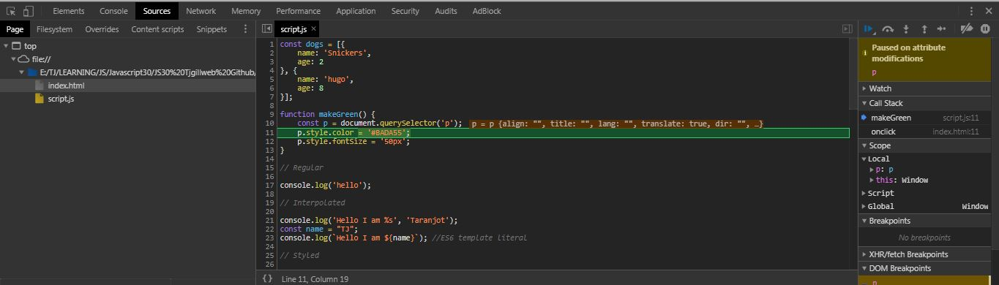
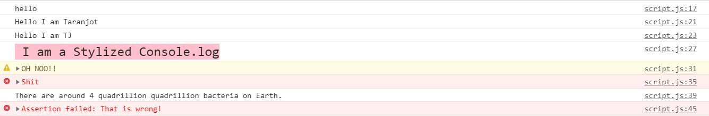
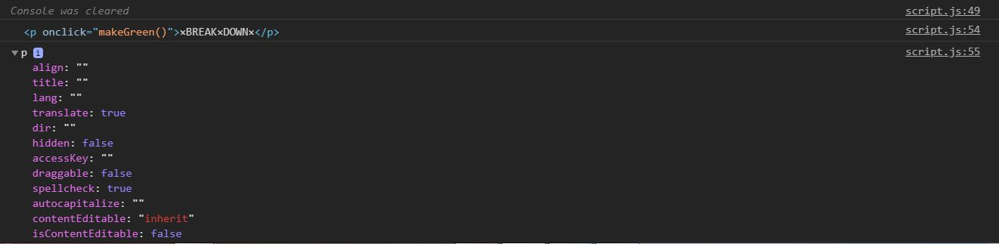
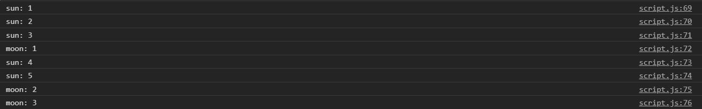
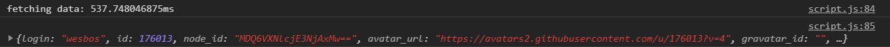
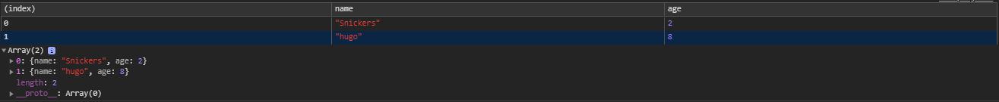

# 09 - 14 Must Know Dev Tools Tricks

**Challenge:** Learn some Dev Tools and Tricks.

**Things To Learn:** Attributes Modification on an element and console tricks.

**Demo:**[here](https://tjgillweb.github.io/JavaScript30/09%20-%20Dev%20Tools%20Tricks/).

So, lets begin!

### 1. Attributes Modification

- We use Attribute Modification option when we have some JavaScript running on the page and we want to know what is causing it. It allows us to make a break point to see what's going on the element.
- So, in the Inspector, select the element in the DOM and right click. Then select the option `Break on -> Attribute Modifications`
- Now when we click on the element on the page, it will pop a debugger command in. It's a break point for us and it will then pause.
- Exactly where it paused, it will show us the line of code that is causing that attribute.



### Console.log Tricks



#### 2. Regular
`console.log('hello');`

#### 3. Interpolation
- We can also interpolate values into `console.log`, but we should prefer using ES6 back-ticks.

```Javascript
console.log('Hello I am %s', 'Taranjot');
const name = "TJ";
console.log(`Hello I am ${name}`); //ES6 template literal
```

- Other ways of interpolation
  - **%d: integer**
  ```Javascript 
  console.log("I am %d years old!", 25); // I am 25 years old!
  ```
  
  - **%f: float**
  ```Javascript 
  console.log("It's %f euros.", 23.5); // It's 23.5 euros.
  ```
  
  - **%o: object**
  ```Javascript 
  console.log("This is an object: %o", {firstName: 'Amber', lastName: 'Simpson', age: 20});
  ```
  
#### 4. Styled
```Javascript 
console.log('%c I am a Stylized Console.log', 'font-size:20px; background: pink;')
```

#### 5. Warning!
- It gives us a warning and will tell us the stack trace as to where it got called. 
```Javascript 
console.warn('OH NOO!!');
```

#### 6. Error
- It won't throw an error, it will just display an error in the console. And again, that will also give you a stack trace as to where that was.
```Javascript 
console.error('Shit');
```

#### 7. Info
```Javascript 
console.info('There are around 4 quadrillion quadrillion bacteria on Earth.');
```

#### 8. Testing
- We can use `console.assert` to check if things are true.
- We can test for something and if it is false, it will throw an error into the console. And if it is true, nothing will happen.
```Javascript 
console.assert(1 === 1, 'That is wrong!'); //This assertion is true, so it won't display anything on the console.
console.assert(1 === 2, 'That is wrong!'); //Assertion failed: That is wrong!
```
```Javascript 
const p = document.querySelector('p');
console.assert(p.classList.contains('ouch'), 'That is wrong!'); //Assertion failed: That is wrong!
``` 

#### 9. Clearing
```Javascript 
console.clear();
```

#### 10. Viewing DOM Elements
- If we `console.log(paragraph)`, it shows us the actual element itself (i.e. the paragraph). But to know what are the available methods and all the properties on that element, we use `console.dir`.
```Javascript 
const paragraph = document.querySelector('p');
console.log(paragraph);
console.dir(paragraph);
```


#### 11. Grouping Together
- We can use nested groups to help organize our output by visually associating related messages. 
- To create a new nested block, call `console.group()`. To exit the current group, call `console.groupEnd()`.
- The `console.groupCollapsed()` method is similar, but the new block is collapsed and requires clicking a disclosure button to read it.
```Javascript 
//use the dogs array of objects to demonstrate
dogs.forEach(dog => {
    console.group(`${dog.name}`); // or use console.groupCollapsed
    console.log(`This is ${dog.name}`);
    console.log(`${dog.name} is ${dog.age} years old`);
    console.groupEnd(`${dog.name}`);
});
```


#### 12. Counting
- `Console.count` will count however many times you use a specific word, or number, or object, or DOM node, or anything that you have.
```Javascript 
console.count('sun');
console.count('sun');
console.count('sun');
console.count('moon');
console.count('sun');
console.count('sun');
console.count('moon');
console.count('moon');
```


#### 13. Timing
- `console.time` starts a timer you can use to track how long an operation takes. You give each timer a unique name, and may have up to 10,000 timers running on a given page. 
- When you call `console.timeEnd()` with the same name, the browser will output the time, in milliseconds, that elapsed since the timer was started.
```Javascript 
console.time('fetching data');
fetch('https://api.github.com/users/wesbos')
    .then(data => data.json())
    .then(data => {
        console.timeEnd('fetching data');
        console.log(data);
    });
```


#### 14. Table Format
```Javascript 
console.table(dogs);
```

