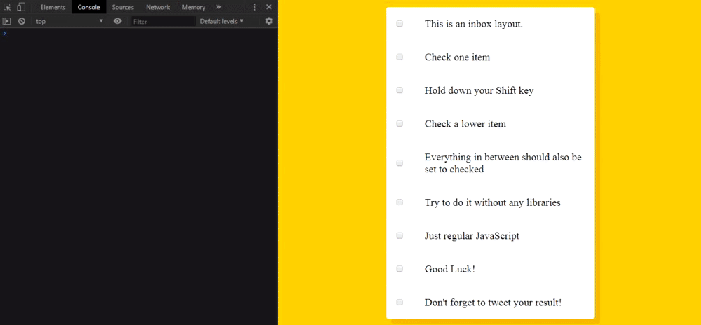

# 10 - Hold Shift to Check Multiple Checkboxes

**Challenge:** Given a list of checkboxes, each of them striked through when an input is checked, write the necessary JavaScript code to allow a user to select multiple items while holding down the shift key i.e. all the checkboxes in between the first one and the last one you checked will then be checked. It should work top to bottom, but also bottom to top.

**Things To Learn:** Click event, how to use flags in building logic.

**Demo:**[here](https://tjgillweb.github.io/JavaScript30/10%20-%20Hold%20Shift%20to%20Check%20Multiple%20Checkboxes/).



So, lets begin!

***Tip:*** Click event will fire even if you use the keyboard.

```Javascript
//select every single one of the checkboxes because we need to listen for when they get checked.
const checkboxes = document.querySelectorAll('.inbox input[type="checkbox"]');

//We need to log when I check the first checkbox, we need to put that into a variable. 
/When we check the second one, and we're holding down shift, we need to know what the last checked checkbox was.
let lastChecked;

function handleCheck(e) {

    let inBetween = false; //flag variable

    //check if the shift key is down
    //and check if the checkbox is checking (not unchecking)
    if (e.shiftKey && this.checked) {
        //go ahead and do what we want
        //loop through every single checkbox every time this happens
        //look for the first one that was checked, and then till the last one was checked.
        checkboxes.forEach(checkbox => {
            console.log(checkbox);
            //checks for both top to bottom and bottom to top
            if (checkbox == this || checkbox == lastChecked) { 
                inBetween = !inBetween; //if its true then it becomes false. If its false, then it becomes true
                console.log('Starting to check them in between');
            }

            // Once we hit the first checkbox(that is checked) inBetween becomes true which is going to check 
            // if it's on and then we programatically set it to checked with JS.
            if (inBetween) {
                checkbox.checked = true;
            }
        });
    }
    lastChecked = this;
}

checkboxes.forEach(checkbox => checkbox.addEventListener('click', handleCheck));
```
