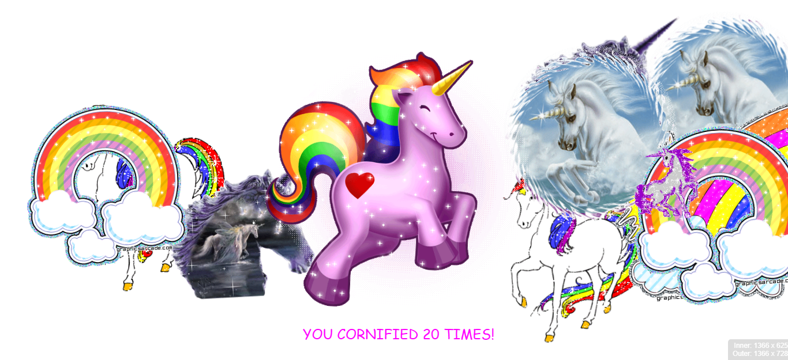
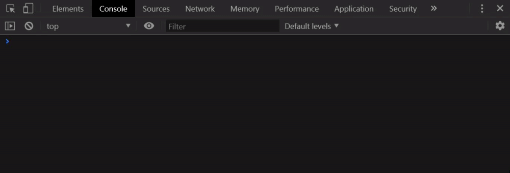

# 12 - Key Sequence Detection

**Challenge:** Learn about key sequencing detection i.e. when someone inputs a certain sequence of keys into your window or into an inputter, store them in an array, and then check every single time that they key up if it matches what you're looking for.

**Things To Learn:** Keyup event. Array methods push, splice and join.

**Demo:**[here](https://tjgillweb.github.io/JavaScript30/12%20-%20Key%20Sequence%20Detection/).



So, lets begin!

- First, we listen for the `keyup` event
```Javascript
window.addEventListener('keyup', (e) => {
    console.log(e.key);
});
```

- Now whenever someone presses one of these items, we're going to push it into an array. So, we're going to first make a `pressed` array.
- Then we also need to look what is the key sequence we're looking for
```Javascript
const pressed = [];
const secretCode = 'tjgill';
```
- Now we push the keys pressed in the pressed array, so it logs all the keys pressed on the keyboard. 
```Javascript
window.addEventListener('keyup', (e) => {
  console.log(e.key);
  pressed.push(e.key);
  console.log(pressed);
```


- But we need to trim this array to be the maximum that we would ever need.
- So, if we're just looking for the word "tjgill," then we are maximum looking for six characters. So, we will splice the array.
- Now we want to start from counting from the back, so that if we're looking for six letters, that's going to go from the back, up seven letters, and then we're going to trim from there.
```Javascript
pressed.splice(-secretCode.length - 1, pressed.length - secretCode.length);
  if (pressed.join('').includes(secretCode)) {
    console.log('DING DING!');
    cornify_add(); //adds unicorns, rainbows and random stuff on screen. A method of cornify.js library.
  }
```


