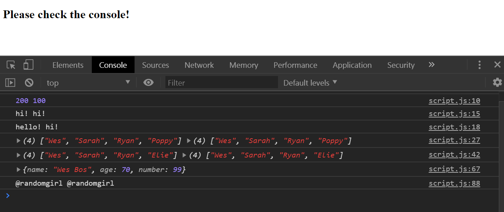

# 14 - Object and Arrays - Reference VS Copy

**Challenge:** Understand the difference between a reference and a copy in JS.

**Things To Learn:** Different ways to make a copy rather than a actual reference in arrays and objects.

**Demo:**[here](https://tjgillweb.github.io/JavaScript30/14%20-%20Object%20and%20Arrays%20-%20Reference%20VS%20Copy/).



So, lets begin!

- In JS, ***numbers, strings and booleans*** `copy by value` i.e. if you change the value in the original variable, the value in the copied variable will not reflect the change. Only the original variable will be changed.
- Whereas, ***arrays and objects*** `copy by reference`, i.e. when you edit the original array or when you update any of the arrays, it's always
going to go back to the reference where it was.

### Ways to make copy of an array, instead of reference
```Javascript
// Let's say we have an array
const players = ['Wes', 'Sarah', 'Ryan', 'Poppy'];
//Copy by reference
const team = players; //'team' is a reference to the original array 'players'
```

#### 1. slice()
```Javascript
const team2 = players.slice();
```

#### 2. concat()
```Javascript
const team3 = [].concat(players);
```

#### 3. ES6 spread[...array]
spread will take every item out of your iterable and put it into a containing array.
```Javascript
const team4 = [...players];
```

#### 4. ES6 Array.from()
```Javascript
const team5 = Array.from(players);
```

### Ways to make copy of an object
```Javascript
// Let's say we have an object person
const person = {
    name: 'Wes Bos',
    age: 80
};
const captain = person; //copy by reference
```
#### 1. Object.assign()
```Javascript
const captain2 = Object.assign({}, person, { number: 99, age: 70 });
```

#### 2. Object spread
```Javascript
const captain3 = {...person};
```

***NOTE:*** this is only 1 level deep - both for Arrays and Objects. So, if you try to copy a nested object, it will copy by reference.
- So, if you need to do a clone, you have to get out a function and go online and find it where it's called `clone deep` and that will clone every level as deep as you want.
- Very rarely do you actually need to clone an object that, so double check whether you really need it.
```Javascript
const tj = {
    name: 'TJ',
    age: 30,
    social: {
        twitter: '@tjgillweb',
        instagram: '@tjgill08'
    }
};
const dev = Object.assign({}, tj);
dev.social.twitter = '@randomgirl';
console.log(tj.social.twitter, dev.social.twitter); // outputs @tjgillweb @randomgirl
```

A **not recommended** way of doing a deep clone is: 
```Javascript
const dev2 = JSON.parse(JSON.stringify(tj)); //not recommended. Poor man's way ;)
```
you can take `JSON.stringify` and pass it an object, and that will return to you a string. That's no longer an object. 
And then you immediately `JSON.parse` it to turn it back into an object, and then you get a full copy of it rather than and you shake all the references.

