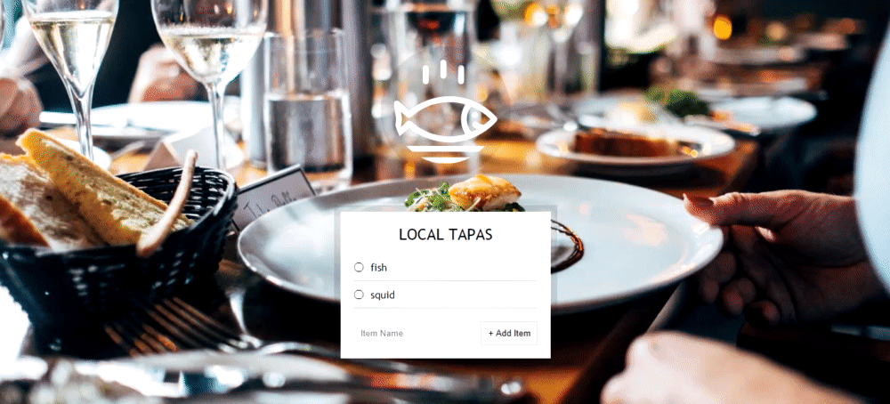
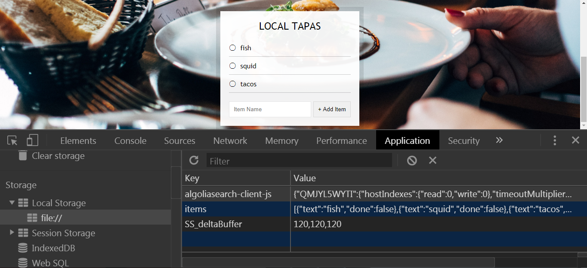

# 15 - LocalStorage and Event Delegation

**Challenge:** The user should be able to add new dishes to the list using the form HTML element without having to refresh the page. Currently, when the user submits a dish into the form, the page reloads (as this is the default action of a submit event) and the list remains empty. Write the necessary JavaScript code to bring functionality to the page.

**Things To Learn:** LocalStorage, event delegation, preserve log(in dev tools)

**Demo:**[here](https://tjgillweb.github.io/JavaScript30/15%20-%20LocalStorage%20and%20Event%20Delegation/).



So, lets begin!

1. Listen for the `submit` event and add an event handler `addItem` to it.
```Javascript
function addItem(e){
    e.preventDefault(); //stop the page from reloading
    console.log(e);

    //this -> actual form and inside of it we look for something with name attribute. 
    //It narrows down the search to a particular form rather than looking in the entire document.
    const text = (this.querySelector('[name=item]')).value;
    
    //put the text of the input field into an object  
    const item = {
        text: text, // or use ES6 shorthand property and write text
        done: false //by default, not checked or taco'ed
    };
    
    items.push(item); //add each item in the items array
    this.reset(); //this is the form element
}
addItems.addEventListener('submit', addItem);
```

2. Create the `populateList` function that will create the actual HTML.
It needs two parameters:
    - it needs a list of plates to populate which we've stored in the `items` array (plates)
    - place to put the HTML (platesList)
```Javascript
// default plates to an empty array because if for some reason you forget to pass something it's not going to break your JS
// its just going to loop over an array of nothing and then the map function will work just fine.
function polulateList(plates = [], platesList){
    platesList.innerHTML = plates.map((plate,i) => {
        return `
        <li>
            <input type="checkbox" data-index=${i} id="item${i}" ${plate.done ? 'checked' : ''} /> //if plate.done is true then check the checkbox
            <label for="item${i}">${plate.text}</label>
        </li>
        `;
    }).join(''); //map returns an array, so to convert it into a string.
}
```
- So, now if everytime we add a new item, it will add it to the list, and we can check it and uncheck it.
- But the other problem here is that if we refresh the page the list is not persisting.
- To solve this problem, we will store our data in `LocalStorage`.
- The way it works is that, we have an object called `LocalStorage` in the browser which will store all the data we have entered, and when we reload the page, we will be able to grab the text out of it.
- Although localStorage might seem like an object, its simply just a key value store and you may only use strings.
- When you try to put anything other than string into LocalStorage, then browser just converts it into a string.



- Push the newly created item object into the items array & store the items array in localStorage. Values saved in localStorage are associated with a key and can only be String values, so we'll convert the items array into a JSON string. 
```Javascript
// When we add an item, you put it into localStorage and you update your localStorage every single time
localStorage.setItem('items', JSON.stringify(items)); //key value of localStorage object
```

- Go back to the event handler function body and call the newly defined function after we've pushed an item object into the items array:
```Javascript
// Right after 'items.push(item)'
populateList(items, itemsList);
```

- At the very top of your JavaScript code, change `const items` which checks on page load if there is something in localStorage, if it isn't there, fall back to an empty array.
```Javascript
const items = JSON.parse(localStorage.getItem('items')) || [];
```
- We need to call the populateList method as soon as the document loads so that we can generate the menu items if there is something in the localStorage:
```Javascript
// Right after 'addItems.addEventListener('submit', addItem);'
populateList(items, itemsList);
```

3. Persist the toggling of list items i.e. if I checked the list item and reload the page, the item should remain checked.

**Event delegation**: Rather than listening for a click or change on these checkboxes directly, we look for somebody who is going to be on the page at the time of listening.
- the UL with a class of plates does exist.. So, we will listen for a click on the plates

```Javascript
itemsList.addEventListener('click', toggleDone);
```
```Javascript
function toggleDone(e) {
    //check if the target matches the thing we're looking for
    if (!e.target.matches('input')) return; //skip this unless its an input
    
    // go to the items array and find the one that was checked and set done:true/false
    const element = e.target;
    const index = element.dataset.index; //tells the index of the corresponding item in the array
    items[index].done = !items[index].done; //update the 'done' property of each item element so that the status of the checkbox is carried across page reloads.
    localStorage.setItem('items', JSON.stringify(items));
    populateList(items, itemsList);
}
```
