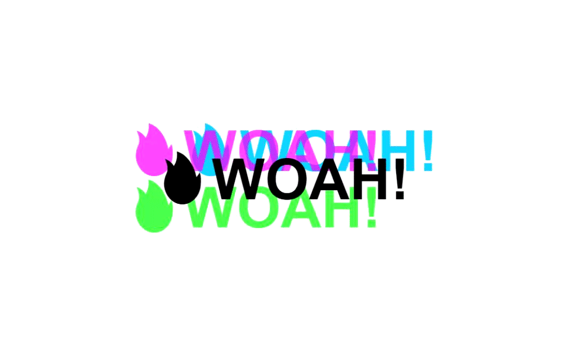

# 16 - Mouse Move Shadow

**Challenge:** Create an effect like on [flexbox.io](https://flexbox.io/). When you move your cursor over top of the window, the text-shadow follows you around. You need to dynamically update the style of the h1 tag depending on where your mouse is on the actual page.

**Things To Learn:** mousemove event, CSS text-shadow property, ES6 Destructuring.

**Demo:**[here](https://tjgillweb.github.io/JavaScript30/16%20-%20Mouse%20Move%20Shadow/).



So, lets begin!

This is our **HTML**
```HTML
<div class="hero">
    <h1 contenteditable>🔥WOAH!</h1>
</div>
```
### Javascript
- Listen for a `mousemove` event on 'hero' and when that changes, we are going to figure out how far and where we should put the text shadow on the text "woah".
```Javascript
const hero = document.querySelector('hero');
const text = hero.querySelector('h1');

function shadow(e){

}
hero.addEventListener('mousemove', shadow);
```
- First thing, get the width and the height of the thing that we have hovered over which is the `hero`.
```Javascript
//const width = hero.offsetWidth;
//const height = hero.offsetHeight;
const {offsetWidth: width, offsetHeight: height} = hero; //ES6 Destructuring
```
- we also need to get the information about where the person's cursor was.
```Javascript
//let x = e.offsetX;
//let y = e.offsetY;
let {offsetX: x, offsetY: y} = e;
```

- Even though we're listening for the mousemove on the hero, if there are children elements inside of the hero(in this case, h1) it's going to give us the x and the y of the actual element that we hovered which is kind of a pain. 
- So what we need to do is if the thing that we're actually hovering is this h1 instead of the hero, then modify the x and the y values, so that they're going to be consistent across all of them.

- The target is going to be the thing that it actually triggered on, whereas this is going to be the thing that you listened on.
- So, its always hero for this, but the target, will sometimes change. If I'm hovering over the text and you see that this is equal to the hero but the target is equal to the h1.
- So if those two things are not the same, we're going to add the pixels that h1 has given us plus whatever it is from the left and whatever it is from the top.
```Javascript
if(this !== e.target){
    x = x + e.target.offsetWidth;
    y = y + e.target.offsetHeight;
}
```

- Now what we need to do is figure out how far the text shadow should actually go. This is something we will call a `walk`. How many pixels, at its most, should it be stretched?
```Javascript
const walk = 100; //100px
```
- If 100 is our walk, then 50 should be as high as we go and negative 50 is as low as we should go. So our walk is 100 but we want to go from 50 to negative 50.
```Javascript
const xWalk = Math.round((x / width * walk) - (walk / 2));
const yWalk = Math.round((y / height * walk) - (walk / 2));
```

- Now finally add the textShadow to our h1
```Javascript
//text.style.textShadow = `${xWalk}px ${yWalk}px 0 red`;
    text.style.textShadow = `
  ${xWalk}px ${yWalk}px 0 rgba(255,0,255,0.7),
  ${xWalk * -1}px ${yWalk}px 0 rgba(0,255,255,0.7),
  ${yWalk}px ${xWalk * -1}px 0 rgba(0,255,0,0.7),
  ${yWalk * -1}px ${xWalk}px 0 rgba(0,0,255,0.7)
`;
```
