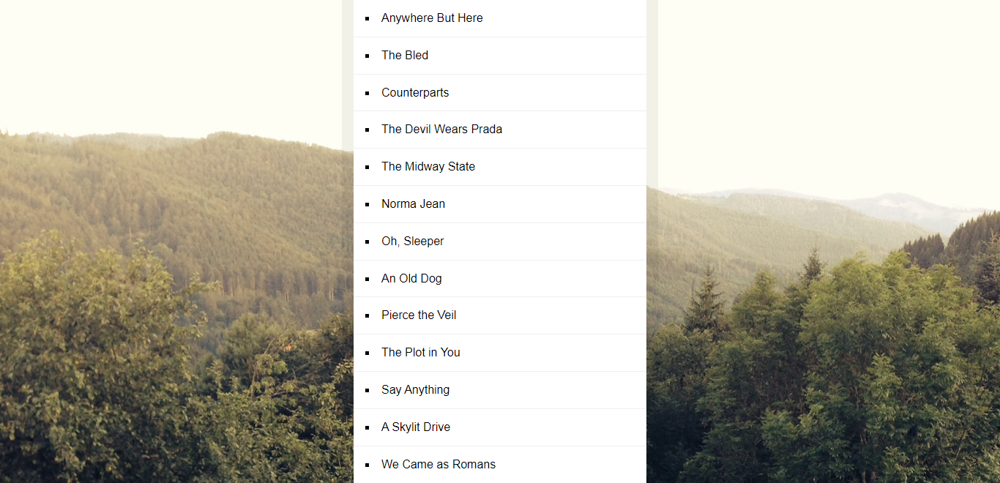

# 17 - Sorting Band Names without articles(a, an, the)

**Challenge:** Sort an array of band names without "The," "An," or "A" in front of the actual band name, because those are articles and they don't go into alphabetizing your actual name of the band.

**Things To Learn:** Array methods sort, map and join, Regex replace().

**Demo:**[here](https://tjgillweb.github.io/JavaScript30/17%20-%20Sorting%20Band%20Names%20without%20articles/).



So, lets begin!

### 1. Sort the bands array
```Javascript
const sortedBands = bands.sort(function (a, b) {
    if (a > b) {
        return 1
    } else {
        return -1;
    }
});
```
or this can be written directly as (after making the strip function):
```Javascript
const sortedBands = bands.sort((a, b) => strip(a) > strip(b) ? 1 : -1);
```

### 2. Create a function `strip()`
The function strip() will take in the bandName, and return the bandName without the articles(a, an, the).
```Javascript
function strip(bandName){
  return bandName.replace(/^(a |an |the)/i, '').trim(); //case insensitive
}
```

### 3. Update the HTML
Select the #bands unordered list and update the inner HTML to be the items in the sortedBands array stored within list items.
```Javascript
const bands = ['The Plot in You', 'The Devil Wears Prada', 'Pierce the Veil', 'Norma Jean', 'The Bled', 'Say Anything', 'The Midway State', 'We Came as Romans', 'Counterparts', 'Oh, Sleeper', 'A Skylit Drive', 'Anywhere But Here', 'An Old Dog'];

function strip(bandName) {
    return bandName.replace(/^(a |an |the)/i, '').trim(); //case insensitive
}
const sortedBands = bands.sort((a, b) => strip(a) > strip(b) ? 1 : -1);

document.querySelector('#bands').innerHTML = sortedBands.map(band => `<li>${band}</li>`).join('');

console.log(sortedBands);
```

