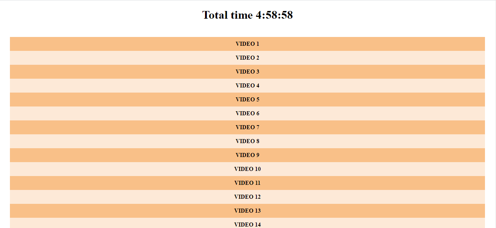
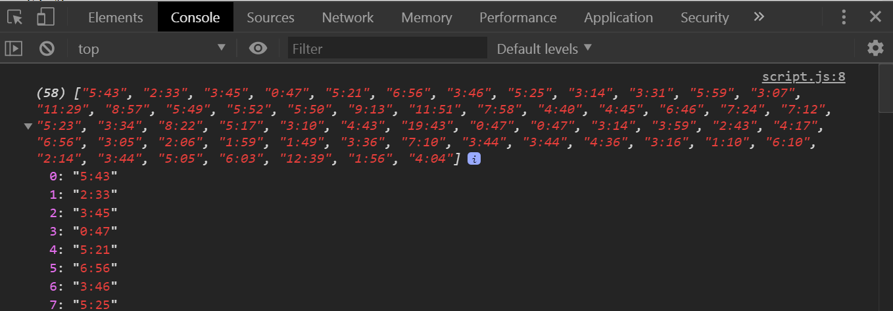
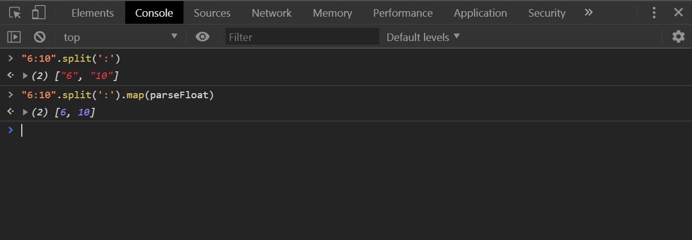
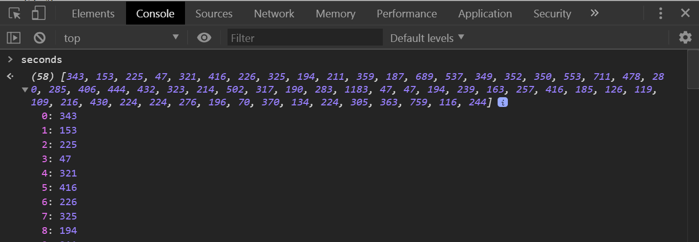
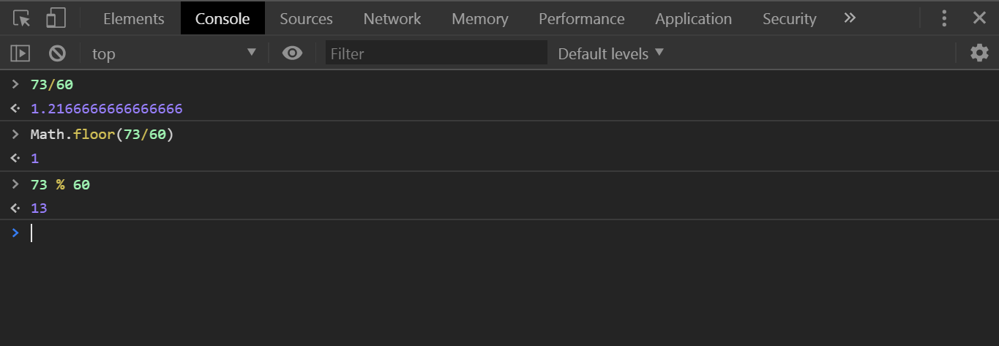

# 18 - Adding Up Times with Reduce

**Challenge:** Given an unordered list with multiple list items, each with a `data-time` which reflect a time in minutes and seconds, take all of these times and calculate the total sum in hours, minutes, and seconds.

**Things To Learn:** parseFloat, mod operator, Array methods map, reduce, split.

**Demo:**[here](https://tjgillweb.github.io/JavaScript30/18%20-%20Adding%20Up%20Times%20with%20Reduce/).



So, lets begin!

### In HTML
```HTML
<ul class="videos">
  <li data-time="5:43">
    Video 1
  </li>
  <li data-time="2:33">
    Video 2
  </li>
  //... and so on
</ul>
```

- Youtube has a `data-time` attribute that is a string containing the minutes and the seconds of the video.
- We need to pull these out of the DOM, convert them to numbers, make them into minutes and seconds, add it all up, figure out how many hours, minutes and seconds there are totally, then finally console.log those actual values.

### In Javascript
#### 1. Select all the nodes
```Javascript
const timeNodes = document.querySelectorAll('[data-time]'); //anything with data-time attribute on it
console.log(timeNodes);
```
- So, we get a bunch of list items. Now we want to turn the list items into an array of actual time strings.
- But before that we need to convert the nodeList into an array, so that we can use array methods on it like map, or reduce.
We can do this in 2 ways:
    - spread it it into a new array 
      ```Javascript
          const timeNodes = [...document.querySelectorAll('[data-time]')];
      ```
    - use array.from
      ```Javascript
          const timeNodes = Array.from(document.querySelectorAll('[data-time]'));
      ```

#### 2. Convert an array of list items into an array of strings
```Javascript
// the seconds variable will be an array of all of the times.
const seconds = timeNodes.map(node => node.dataset.time); 
```


#### 3. Convert into just seconds
```Javascript
const seconds = timeNodes.map(node => node.dataset.time).map(timeCode => {
    const [mins, secs] = timeCode.split(":");
    return (mins * 60) + secs;
    console.log(mins, secs);
});
```



- When we use timeCode.split(":"), it splits into strings, but we want number so that we can perform calculation on the time.
- So to solve this, we could just map over that array real quick and you could pass it `parseFloat`.
- The `parseFloat` function parses a string argument and returns a floating point number.
- It will run the parseFloat function against every item in the result array.
```Javascript
// you can just pass in the parseFloat function directly and it will call that function against every item in that array.
const [mins, secs] = timeCode.split(":").map(parseFloat);

// this is the same thing as
const [mins, secs] = timeCode.split(":").map(function(str){
return parseFloat(str);
})
```

So, our seconds are all adding up.



### 3. Add them all together.

- So, `reduce` the array to get the total seconds. Reduce is a really good way. If map takes in an array and exports an array, a reduce will take in an array and return anything you want. It could be a number, it could be a string, or an object.
- In our case, we are going to take all of these numbers and reduce them down into one big number.
```Javascript
const seconds = timeNodes
  .map(timeNode => timeNode.dataset.time)
  .map(timeCode => {
    const [mins, secs] = timeCode.split(':').map(parseFloat);
    return (mins * 60) + secs;
  })
  .reduce((total, vidSeconds) => total + vidSeconds);    // total seconds 17938

console.log(seconds);
```
### 4. Chop down the seconds variable into hours, minutes, and seconds
```Javascript
let secondsLeft = seconds;
const hours = Math.floor(secondsLeft / 3600); //Math.floor to get rid of the decimal point
secondsLeft = secondsLeft % 3600;

const mins = Math.floor(secondsLeft / 60);
secondsLeft = secondsLeft % 60;
console.log(hours, minutes, seconds);
```

What is the secondsLeft? Lets take a look at what's happening here:



- If I have 73 seconds and I divide that by 60 seconds, we clearly have 1 whole minute. `Math.floor(73/60)` shows us 1 whole minute.
- But what is that point two seconds? That's not twenty seconds because that's a percentage. 
- So `73 % 60` will tell us that after we chunk it out into 1 whole minute, we have 13 seconds left.

- After we chunk it into the hours, we are going to have these many seconds left.

