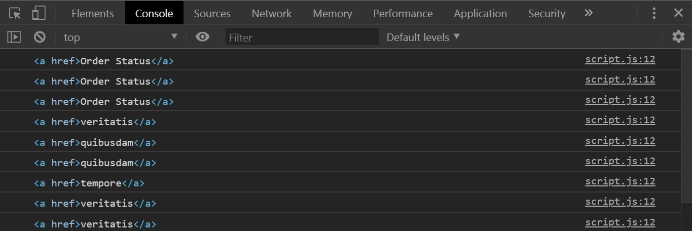
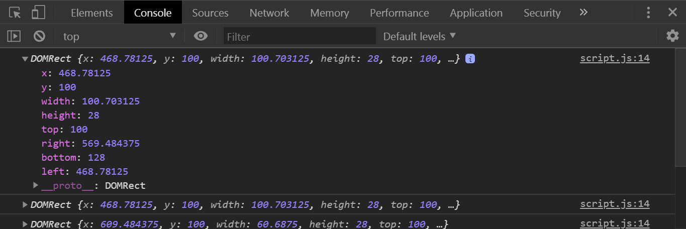

# 22 - Follow Along Links

**Challenge:** When you hover over any of the links on the page, create a little pill that's going to both resize itself, so it's short and
long, as well as follow you around the page wherever the link is going.

**Things To Learn:** `mouseenter` event, `getBoundingClientRect()` function

**Demo:**[here](https://tjgillweb.github.io/JavaScript30/22%20-%20Follow%20Along%20Links/).


So, lets begin!

### 1. Get all of `triggers` (things that will be hovered, that need a background behind it).
```Javascript
const triggers = document.querySelectorAll('a');
```
### 2. Create a span called `highlight` in JS.
- When you highlight over something, it will figure out the width, the height, and where on the page that actual item is.
- Because there are CSS transitions on this element, it's just going to transition itself from place, and the `width`, the
`height`, and the `transform(translateX, translateY)` values, are going to be moved on over.

```Javascript
// create a span tag with a class of 'highlight'
const highlight = document.createElement('span');
highlight.classList.add('highlight');

//put it into the DOM
document.body.append(highlight);
```

### 3. Listen for the `mouseenter` event on each of our triggers
```Javascript
function highlightLink() {
    //highlight triggering on all of the links on the page
    console.log(this); //log the actual link that we're looking for.
}
triggers.forEach(a => a.addEventListener('mouseenter', highlightLink));
```



### 4. Figure out the width, the height, the X and the Y
- We need to figure out how big is the element that we hovered? 
- And where on the page is that actual element?
- So, we'll use a method called `getBoundingClientRect()`.It gives us all the information about where on the page does the link actually live.

```Javascript
function highlightLink() {
    const linkCoords = this.getBoundingClientRect();
    console.log(linkCoords);
    highlight.style.width = `${linkCoords.width}px`;
    highlight.style.height = `${linkCoords.height}px`;
    highlight.style.transform = `translate(${linkCoords.left}px, ${linkCoords.top})`;
}
```



### 5. Animate the left and the right values.
```CSS
.highlight {
//transition of width of the link expanding/shrinking when we hover over links of different width/height.
//If we didn't have that transition on there it would just be immediate snaps when we hover between links.
  transition: all 0.2s; 
}
```
- take how far the person has scrolled down, and then add that to our actual item.
```Javascript
const coords = {
        width: linkCoords.width,
        height: linkCoords.height,
        top: linkCoords.top + window.scrollY,
        left: linkCoords.left + window.scrollX
    }
    highlight.style.width = `${coords.width}px`;
    highlight.style.height = `${coords.height}px`;
    highlight.style.transform = `translate(${coords.left}px, ${coords.top}px)`;
```


