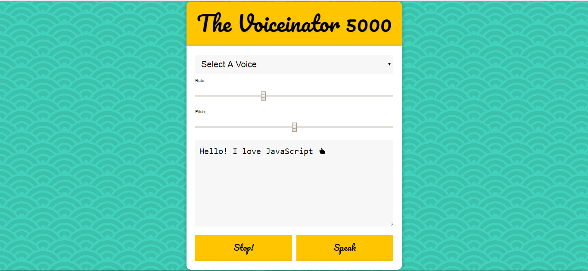
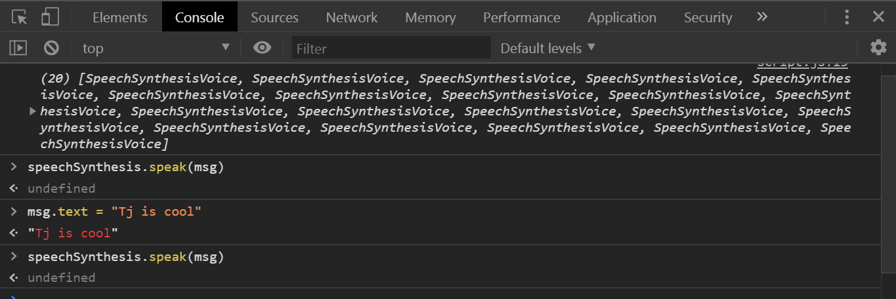
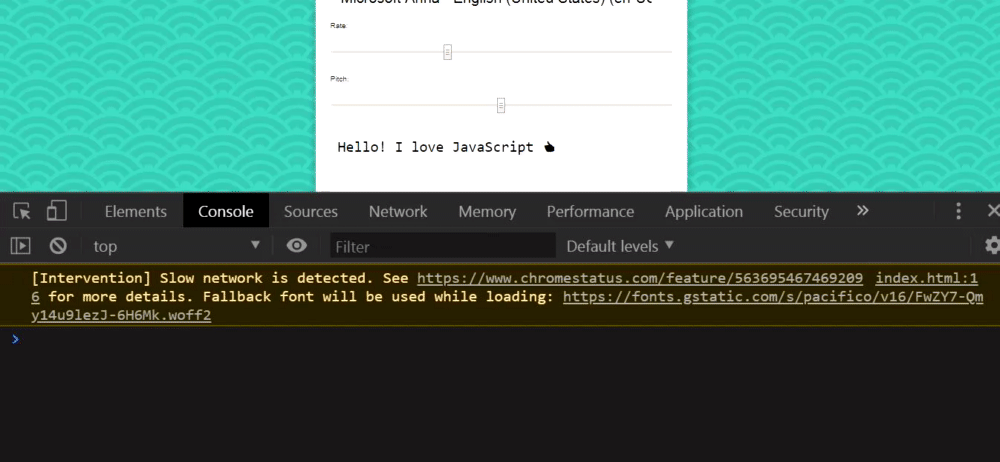

# 23 - Speech Synthesis

**Challenge:** Work with Speech Synthesis API that comes in most modern browsers. Convert text to voice.

**Things To Learn:** `voiceschanged` event, `speechSynthesis` variable and its properties, array methods `filter`, `map`, `find`, how to pass in a function as an argument.

**Demo:**[here](https://tjgillweb.github.io/JavaScript30/23%20-%20Speech%20Synthesis/).



So, lets begin!

### HTML
```HTML
<select name="voice" id="voices">
  <option value="">Select A Voice</option>
</select>

<label for="rate">Rate:</label>
<input name="rate" type="range" min="0" max="3" value="1" step="0.1">

<label for="pitch">Pitch:</label>

<input name="pitch" type="range" min="0" max="2" step="0.1">
<textarea name="text">Hello! I love JavaScript 👍</textarea>
<button id="stop">Stop!</button>
<button id="speak">Speak</button>
```

- The important thing to know here is that the "name" of `rate`, `pitch`, and `text` inputs will line up with the property on the utterance which is essentially the voice that's going to say it.

### Javascript
- Create a new `SpeechSynthesisUtterance` and that essentially means what is the person going to say.
```Javascript
const msg = new SpeechSynthesisUtterance();
```
- And on that utterance, it's going to contain information about 
  - how fast do they say it, 
  - what is the pitch that they say it
  - what is the voice that they say it in, and 
  - what will they be saying. 
  
So all these four things that we have here, those are going to be put onto our utterance.

```Javascript
// create an empty array which our voices are going to be dumped into.
let voices = [];
// select al the input fields and buttons
const voicesDropdown = document.querySelector('[name="voice"]');
const options = document.querySelectorAll('[type="range"], [name="text"]');
const speakButton = document.querySelector('#speak');
const stopButton = document.querySelector('#stop');
```
- On page load, whatever is in this text area, I want to set that to be the default.
```Javascript
msg.text = document.querySelector('[name = "text"]').value;
```

### `populateVoice()` function
- We also have another global variable called `speechSynthesis`. We can call .speak on it and pass it an utterance which is going to be our msg.
`speechSynthesis.speak(msg)`. But it doesn't work just yet and that's because there is no voice.
- We can add an Event Listener to the `SpeechSynthesis` global variable.
```Javascript
function populateVoices(){
    voices = this.getVoices(); //gets a list of built-in voices
    console.log(voices); 
    // loop over all of the speech voices and set them as options in the drop down.
    const voiceOptions = voices
        .map(voice => `<option value="${voice.name}" >${voice.name} (${voice.lang})</option>`)
        .join();
    voicesDropdown.innerHTML = voiceOptions;
}
speechSynthesis.addEventListener('voiceschanged', populateVoices);
```



### `setVoice() function`
- Now we want to be able to choose one of the options from the drop down.
- For that we create a function `setVoice` that's going to be called when we change from the drop down.
- We need to find the corresponding `speechSynthesis` voice object and loop over every single one of the voices in the array and it's going to find the one where its name attribute is the same as the option that was currently selected like Alva,
```Javascript
function setVoice(){
    //find the voice that lines up with the value. 
    //console.log(this.value); //gives the value of the selected dropdown
    msg.voice = voices.find(voice => voice.name === this.value);
}
voicesDropdown.addEventListener('change', setVoice);
```

### `toggle()` function
- Make a function for every time when we change one of the dropdown values, it will restart the voiceover.
- toggle() itself would just restart it and toggle(false) will stop it all.
```Javascript
function toggle(startOver = true) {
    speechSynthesis.cancel(); // stop it from speaking
    if (startOver) {
        speechSynthesis.speak(msg);
    }
}
```
- Call toggle() in the `setVoice()` function.
```Javascript
function setVoice() {
    ...
    toggle();
}
```

### `setOption` function
- Next, we will work with our rate, our pitch, as well as our message.
- Listen for a `change` event on `options`
```Javascript
function setOption() {
    console.log(this.name, this.value);
}
options.forEach(option => option.addEventListener('change', setOption));
```



When the 'options' change, we know what property will change which is `this.name`, and what it was changed to which is `this.value`.
```Javascript
function setOption() {
    console.log(this.name, this.value);
    msg[this.name] = this.value;
    toggle();
}
```

### Add Event Listeners for Buttons 'Stop' and 'Speak'
```Javascript
speakButton.addEventListener('click', toggle);
```
```Javascript
stopButton.addEventListener('click', toggle(false));
```
But this not the right way of passing the argument as it will only run once on page load, because this function does not return anything.
How do you pass an argument to a function? There are 3 ways of doing this:
```Javascript
// 1. pass a function
stopButton.addEventListener('click', function(){
  toggle(false);
});

//2. use bind
// what bind does is you take a function and then you call it in the context of this and pass it an argument, a false
stopButton.addEventListener('click', toggle.bind(null, false));

//3. ES6 Arrow function
stopButton.addEventListener('click', () => toggle(false));
```

### Filter the dropdown list for only ones that are English
```Javascript
function populateVoices() {
    voices = this.getVoices();
    const voiceOptions = voices
        .filter(voice => voice.lang.includes('en')) //filter the list down to ones that include EN before we map over it
        .map(voice => `<option value="${voice.name}" >${voice.name} (${voice.lang})</option>`)
        .join();
    voicesDropdown.innerHTML = voiceOptions;
}
```
