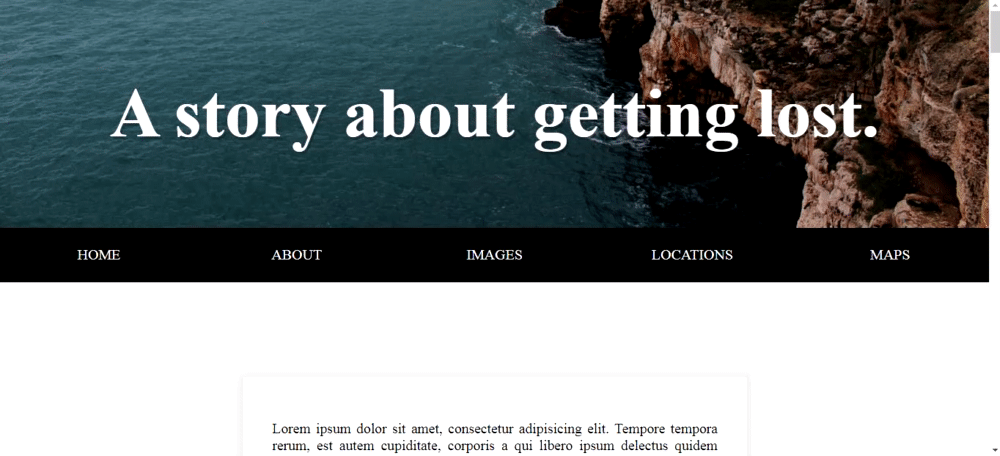

# 24 - Sticky Nav

**Challenge:** Position the Nav such that as soon as you hit the point where it hits the top of the browser, we're going to make it fixed so the content scrolls underneath. And also make the logo scroll out from the left.

**Things To Learn:** window `scroll` event, how to fix `position:fixed`, CSS transitions on adding class in JS.

**Demo:**[here](https://tjgillweb.github.io/JavaScript30/24%20-%20Sticky%20Nav/).



So, lets begin!

Quite an easy one! So lets cut the crap and come straight to code.

```Javascript
const nav = document.querySelector('#main');
const topOfNav = nav.offsetTop; //top of nav bar

// runs every single page scroll
function fixNav() {
    if (window.scrollY >= topOfNav) {
      document.body.style.paddingTop = nav.offsetHeight + 'px';  //height of nav bar
      document.body.classList.add('fixed-nav');
    } else {
      document.body.style.paddingTop = 0;
      document.body.classList.remove('fixed-nav');
    }
  }
window.addEventListener('scroll', fixNav);
```

### Javascript
- Let's say we've scrolled 500 pixels from the top. and then when we scroll, we're going to figure out how far are we scrolled?
- But as soon as I hit that threshold of scrolling more than the top of the nav is, so as soon I've scrolled 501 pixels, the nav bar should fix to the top.
- To do that we add a class 'fixed-nav' to the 'body' not the 'nav' so that we can always target any of the children when we're in the fixed nav
state.
- When we make an element `position: fixed`, it no longer takes up space. It sort of floats on top of the browser. So, it causes a reflow on the page and this site-wrap moves on up the exact amount of space that the nav bar gave up.
- So, need to offset that amount by adding some padding to our body. 
So just as we make the nav bar fixed, we need to offset that amount so we don't get a jerky jump on the page.
```Javascript
document.body.style.paddingTop = nav.offsetHeight + 'px'; 
```

### CSS
- To make the navbar fixed
```CSS
.fixed-nav nav {
  position: fixed;
  box-shadow: 0 5px rgba(0, 0, 0, 0.1);
}
```
- To make the logo transition from left
```CSS
// logo before .fixed-nav
li.logo {
  max-width: 0;
  overflow: hidden;
}

// logo after scroll
.fixed-nav li.logo{
  max-width: 500px; //don't use max-width: auto. It does not lead to transition. 
}
```

- To make the site-wrap grow bigger in size as we scroll
```CSS
.fixed-nav .site-wrap{
  transform: scale(1);
}
```


 
