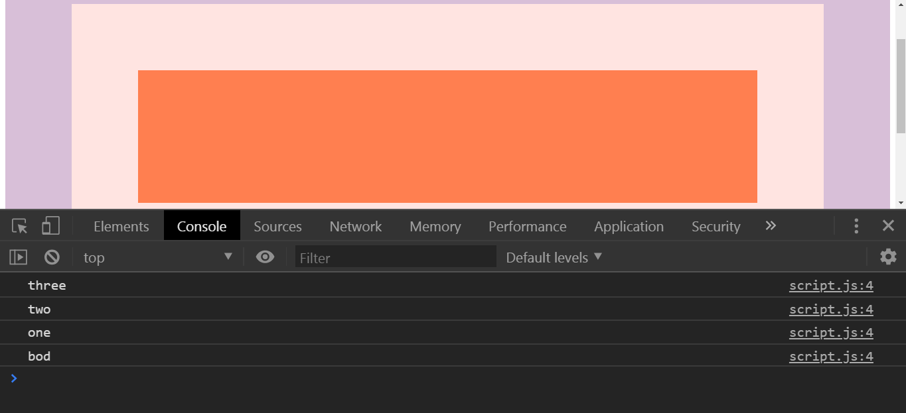
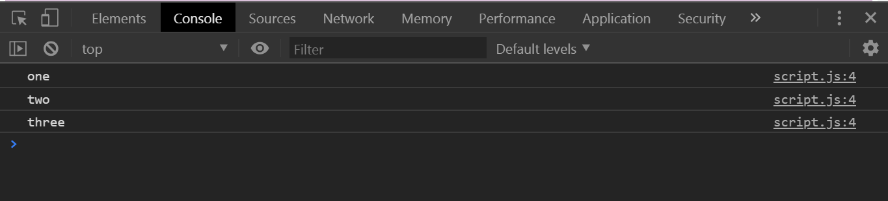

# 25 - Event Capture, Propagation, Bubbling and Once

**Challenge:** Learn about propagation, bubbling, event capturing, as well as using the new property called `once`.

**Things To Learn:** 

**Demo:**[here](https://tjgillweb.github.io/JavaScript30/25%20-%20Event%20Capture,%20Propagation,%20Bubbling%20and%20Once/).


So, lets begin!

We've got three nested divs.
```HTML
<div class="one">
  <div class="two">
    <div class="three">
    </div>
  </div>
</div>
```

Select all the divs and listen for a click.
```Javascript
const divs = document.querySelectorAll('div');

function logText(e){
  console.log(this.classList.value);
}
divs.forEach(div => div.addEventListener('click', logText));
```
### Event Bubbling
What happens when we click on the innermost box(coral box)? What will log to the console?

three

two

one

If we have `<body class="bod">` and add this JS and click on box three, what will we log?
```Javascript
document.body.addEventListener('click', logText);
```


- What happened here is that we clicked on three, but we really also clicked on two, because it wraps around it, and we also clicked on one, we also clicked on the body, we also clicked on the html tag, and so on.
- This is called `bubbling` where the browser will figure out what you clicked on, but it will also trigger clicks up the DOM and they'll ripple all the way up.
- The way that it works in modern browsers is that the browser will first do something called a `capture`, which means that when you click on the element, it's going to ripple down. It goes from the top down, and then it captures all of the events, and then it starts at the bottom, and then starts doing something called a `bubble`.
- So the capture goes from top down, and then the events haven't fired yet. It just captures where you clicked, and is storing them.  Then it will start to bubble up, which means that it's triggering the events as you go up.

### Capture
- In the addEventListener, add a third argument after the function which is an options object
```Javascript
divs.forEach(div => div.addEventListener('click', logText, {
    capture: true
}));
```

Now when we click on box three what we get is:



- By adding `capture: true`, logText() is not going to get run on the bubble up, it's going to get run on the capture down.
- By default it is false, so that returns the bubble up i.e (three, two, one)

### e.stopPropagation()

- Stops bubbling the events up and no longer triggers events on the parents on the way on up. It returns the element that we actually clicked on.
```Javascript
function logText(e){
  console.log(this.classList.value);
  e.stopPropagation();
}
```
- Now when we click on box three, it will return three, when we click on box two, it return two, and so on.

- What happens if we use `e.stopPropagation` and `capture: true`? It returns one.

### once
- In the addEventListener options object, we have an option called `once`.
- If we set `once:true`, what will happen is it will listen for a click and then unbind itself so that there's no future clicks on it.
- Its the same thing as saying `div.removeEventListener('click', logText);`.
```Javascript
divs.forEach(div => div.addEventListener('click', logText, {
    capture: false,
    once: true
}));
```
So it will return only once: 

three

two

one

- It ran once, it fired all those events, but it will never run again, until I rerun the page.
- That could be helpful if you have a button and you only want somebody to click that button once, like checkout button.

```Javascript
button.addEventListener('click', () => {
    console.log('click!');
}, {
    once: true
});
```

