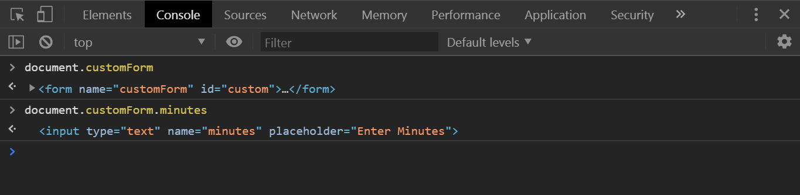

# 29 - Countdown Clock

**Challenge:** Create a countdown timer that will show us how many seconds are left in some sort of task, like a 15-minute break. You need to be able to click these
buttons or you can put in the number of minutes that you'd like. It should count it down as well as show you what time to be back.

**Things To Learn:** setInterval, how to select element using name attribute
**Demo:**[here](https://tjgillweb.github.io/JavaScript30/29%20-%20Countdown%20Clock/).


So, lets begin!

### `timer()`function
```Javascript
let countdown; //variable to store the countdown interval

// seconds is the number of seconds you wish to run the timer for
function timer(seconds) {
    //clear any existing timers
    clearInterval(countdown);

    //when the timer started
    const now = Date.now(); // current timestamp in milliseconds
    // when the timer stops
    const then = now + seconds * 1000; //to convert seconds into milliseconds
    displayTimeLeft(seconds); // if timer(10), then this displays 10 and setInterval shows 9,8,7,...
    displayEndTime(then);

    //every single second, we need to display the amount of time left.

    countdown = setInterval(() => {
        const secondsLeft = Math.round((then - Date.now()) / 1000); //convert milliseconds to seconds
        //check if we should stop it
        if (secondsLeft < 0) {
            clearInterval(countdown);
        }

        //display it
        displayTimeLeft(secondsLeft);

    }, 1000) //run every 1000ms or 1s
}
function displayTimeLeft(seconds) {
  console.log(seconds);
}  
```
**Problem:** If I run 10 seconds, only after one second elapses does it actually run. The problem with that is that setInterval does not run immediately. It has to wait for the first second to elapse. 

**Solution:** So what we do is, we'll create a second function called `displayTimeLeft` and we run that as soon as the function is invoked immediately once, and then once again, every single time inside the setInterval.

### Converting time into minutes and seconds.
(you can also do hours if you want)
```Javascript
const timerDisplay = document.querySelector('.display__time-left');
```
```Javascript
function displayTimeLeft(seconds) {
    const minutes = Math.floor(seconds / 60);
    const remainderSeconds = seconds % 60;
    const display = `${minutes}:${remainderSeconds}`;
    timerDisplay.textContent = display;
    document.title = display; // update title on the tab on our browser with the countdown time
}
```
**Problem:** When we have less than 10 seconds left, it just says 4 seconds, but it should be 04 seconds left.

**Solution:** Update this line in above code with the following line of code:
 ```Javascript
 const display = `${minutes}:${remainderSeconds < 10 ? '0' : ''}${remainderSeconds}`;
 ```
 
### Showing the ending time
If it's 2:30 and you have a five-minute break, I want to say "be back at 2:35". Create a function `displayEndTime`
 ```Javascript
const endTime = document.querySelector('.display__end-time');
```
```Javascript
function displayEndTime(timestamp) { //timestamp of when you want to finish i.e. the 'then' variable
    //turn the timestamp into a date
    const end = new Date(timestamp);
    const hour = end.getHours();
    const adjustedHour = hour > 12 ? hour - 12 : hour; // adjust time according to 12-hour clock
    const minutes = end.getMinutes();
    endTime.textContent = `Be Back At ${adjustedHour}:${minutes < 10 ? '0' : ''}${minutes}`;
}
```

### Hook up all of the different buttons at the top to the code
```Javascript
const buttons = document.querySelectorAll('[data-time]');
```
```Javascript
function startTimer(){
    const seconds = parseInt(this.dataset.time);
    timer(seconds);
}
buttons.forEach(button => button.addEventListener('click', startTimer));
```

**Problem:** When we click on the buttons one after the other, the timer behaves wierdly, it goes back and forth.
It happened because we queued up like 1000 timers and there's no way for the timers to cancel themselves out unless the number of seconds hits zero.

**Solution:** When we start our timer, we will just clear any existing timers.
```Javascript
function timer(seconds) {
    //clear any existing timers
    clearInterval(countdown);
    ...
}
```

### Take the time from the form input and display it
```Javascript
document.customForm.addEventListener('submit', function(e){
    e.preventDefault(); //prevent the form from submitting the value in the URL
    const mins = this.minutes.value; // same as document.customForm.minutes.value
    timer(mins * 60); //convert minutes to seconds
    this.reset(); //reset the form
 });
```
Notice that we did not create a separate variable to select the form element like this:
```Javascript
const form = document.querySelector('.customForm');
```
***NOTE:*** Its not necessary to always select your elements before using them.
We can access them directly using document.[name attribute of the element] (if the element has a name attribute on it)
**Example: **
```HTML
<form name="customForm" id="custom">
    <input type="text" name="minutes" placeholder="Enter Minutes">
</form>
```
- We can directly write `document.customForm` and that will give us the form element.
- Similarly, if your input also has a name, it'll just nest itself. So, we can write `document.customForm.minutes` and that will give us the input.


