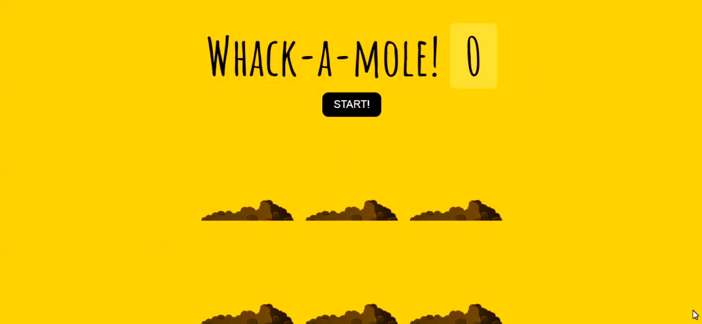
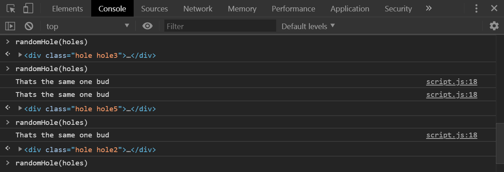

# 30 - Whack A Mole

**Challenge:** Build a game Whack-a-mole. What happens is when you run the game:
- you're going to get these little critters popping up in random holes for for random amounts of time.
- when you click them you get a point (have to follow it along with your mouse).
- the game itself is going to be 10 seconds long
- which hole the mole pops up in and for how long that mole peeps his head up from the ground is totally random, it's all going to be between like 200 milliseconds and a couple of seconds.
- the mole hill that it's going to pop up from is also going to be totally random as well.

**Things To Learn:** setTimeout(), `e.isTrusted` and how to set random time.

**Demo:**[here](https://tjgillweb.github.io/JavaScript30/30%20-%20Whack%20A%20Mole/).



So, lets begin!

#### Select elements and declare variables
```Javascript
const holes = document.querySelectorAll('.hole');
const scoreBoard = document.querySelector('.score');
const moles = document.querySelectorAll('.mole');
let lastHole;
let timeUp;
let score = 0;
```

### function `randomTime()`
- First need a function that's going to give us a random amount of time between a minimum and maximum value.
```Javascript
function randomTime(min, max) {
    return Math.round(Math.random() * (max - min) + min);
}
```

### function `randomHole()`
- Second, we need a function that's going to pick a random hole for the mole to pop up from
```Javascript
function randomHole(holes) {
    console.log(holes.length); //returns 6 because holes is a NodeList which contains all 6 holes
    const idx = Math.floor(Math.random() * holes.length); //find a random index between 0 and 5
    const hole = holes[idx];
    console.log(hole);
}
```
**Problem:** Sometimes we get the same hole number twice in a row, but we want a different number each time because we don't want the same mole popping up.

**Solution:** Create a variable `let lastHole;` and update the `randomHole` function as follows:
```Javascript
function randomHole(holes) {
    //console.log(holes.length); //returns 6 because holes is a NodeList which contains all 6 holes
    const idx = Math.floor(Math.random() * holes.length); //find a random index between 0 and 5
    const hole = holes[idx];
    //console.log(hole);

    // if it was the same one that popped up last time
    if (hole === lastHole) {
        console.log("Thats the same one bud");
        return randomHole(holes); //run the function again (recursion)
    }
    lastHole = hole; //reference to which one got popped up last time the function was called
    return hole;
}
```


### function `peep()`
- Actually get the moles popping up
```Javascript
function peep() {
    const time = randomTime(200, 1000); //between 200 milliseconds and 1 second
    const hole = randomHole(holes);
    hole.classList.add('up');
    setTimeout(() => {
        hole.classList.remove('up');
        if(!timeUp) peep(); //unless the game is over we just need to run it again.
    }, time);
}
```

### function `startGame()`
```Javascript
function startGame() {
    scoreBoard.textContent = 0;
    timeUp = false;
    score = 0;
    peep();
    // run the game for 10 seconds
    setTimeout(() => timeUp = true, 10000);
}
```

### function `bonk()`
- The last piece that we need is when you click on a mole, we need to bonk them on the head. 
- Inside `MouseEvent` object we have a property called `isTrusted`. If you fake clicking something with JavaScript then isTrusted = false;
```Javascript
function bonk(e) {
    if (!e.isTrusted) return; //fake click - cheater!!
    score++;
    this.classList.remove('up'); 
    scoreBoard.textContent = score;
}
moles.forEach(mole => mole.addEventListener('click', bonk));
```
